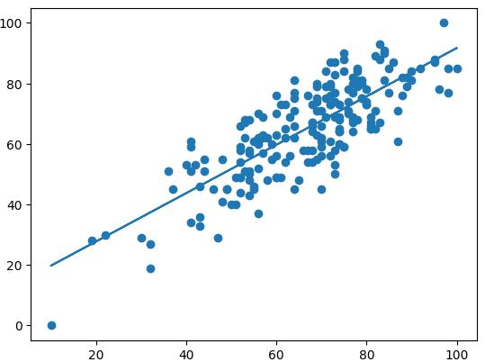

# Linear Regration
Linear regration is a simple meaching learning algorithm used for simple datasets where we can pridict the output just by multiplying the input with a number called slope and adding a number called intercept.

**Formula:**

$$
y = mx + b
$$

where

- **x** = input
- **y** = prediction
- **m** = slope
- **b** = intercept

**Example**



Here, the line cutting through the data plot is called *Regression Line*. This line is **the modal** that has learn to pridict.

---

## In Python (Scikit-Learn)

```py
import pandas as pd
from sklearn.model_selection import train_test_split
from sklearn.linear_modal import LinearRegression

df = pd.read_csv("data.csv")

X = df[["x"]]
y = df["y"]

X_train, X_test, y_train, y_test = train_test_split(
  X,
  y,
  test_size=0.2,
  random_state=42
)

modal = LinearRegression()

modal.fit(X_train, y_train)

prediction = modal.prediction(X_test)
```

### Explanation:

**Import libaries**

```py
import pandas as pd
from sklearn.model_selection import train_test_split
from sklearn.linear_modal import LinearRegression
```

It imports:
- **Pandas:** to work with dataframe
- **`train_test_split`:** to split data to train and test data
- **`LinearRegression`:** to import linear regression model 

**Load Datasets**

```py
df = pd.read_csv("data.csv")
```

This loads csv file to pandas dataframe format so that we can work with the dataset

**Choosing the input**

```py
X = df[["x"]]
y = df["y"]
```
**Note:** sklearn expect the `X` to be table(2D array) even if there is only one feature.

**Split the data**

```py
X_train, X_test, y_train, y_test = train_test_split(
  X,
  y,
  test_size=0.2,
  random_state=42
)
```

This splits `0.2*100%` = `20%` data for testing and other for training.
