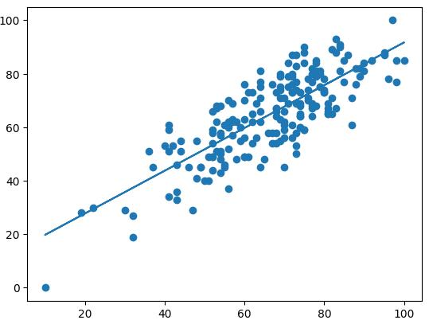

# Linear Regration
Linear regration is a simple meaching learning algorithm used for simple datasets where we can pridict the output just by multiplying the input with a number called slope and adding a number called intercept.

**Formula:**

$$
y = mx + b
$$

where

- **x** = input
- **y** = prediction
- **m** = slope
- **b** = intercept

**Example**



Here, the line cutting through the data plot is called *Regression Line*. This line is **the modal** that has learn to pridict.

---

## In Python (Scikit-Learn)

```py
import pandas as pd
from sklearn.model_selection import train_test_split
from sklearn.linear_model import LinearRegression

df = pd.read_csv("data.csv")

X = df[["x"]]
y = df["y"]

X_train, X_test, y_train, y_test = train_test_split(
  X,
  y,
  test_size=0.2,
  random_state=42
)

model = LinearRegression()

model.fit(X_train, y_train)

prediction = model.predict(X_test)
```

### Explanation:

**Import libaries**

```py
import pandas as pd
from sklearn.model_selection import train_test_split
from sklearn.linear_model import LinearRegression
```

It imports:
- **Pandas:** to work with dataframe
- **`train_test_split`:** to split data to train and test data
- **`LinearRegression`:** to import linear regression model 


**Load Datasets**

```py
df = pd.read_csv("data.csv")
```

This loads csv file to pandas dataframe format so that we can work with the dataset

**Choosing the input**

```py
X = df[["x"]]
y = df["y"]
```
**Note:** sklearn expect the `X` to be table(2D array) even if there is only one feature.

**Split the data**

```py
X_train, X_test, y_train, y_test = train_test_split(
  X,
  y,
  test_size=0.2,
  random_state=42
)
```

This splits `0.2*100%` = `20%` data for testing and other for training.
**Note:** here `random_state` is the seed for spliting data so that it return always the same data

**Create model**

```py
model = LinearRegression()

model.fit(X_train, y_train)
```

Here:
- **`model = LinearRegression()`:** Creates an empty model
- **`model.fit(X_train, y_train)`:** Trains modal by feeding `X_train` and `y_train` data

**Predicting or testing model**

```py
prediction = model.predict(X_test)
```

Here:

The modal predict the output in the test data according to the data it was given for training.

---

## Error/Accuracy of a model

### 1. Mean Absolute Error (MAE)

**Mathematical formula:**

$$
MAE = \frac{1}{n} \sum_{i=1}^{n} |y_i - \hat{y_i}|
$$

**In python**

```py
from sklearn.metrics import mean_absolute_error

mae = mean_absolute_error(y_test, prediction)
print(mae)
```

Here
- We import `mean_absolute_error` from `sklearn.metrics`
- Get the error using `y_test` and `prediction` from the imported function

---

### 2. Mean Squared Error (MSE)

**Mathematical formula**

$$
MSE = \frac{1}{n} \sum_{i=1}^{n} (y_i - \hat{y_i})^2
$$

**In python**

```py
from sklearn.metrics import mean_squared_error

mse = mean_squared_error(y_test, prediction)
print(mse)
```

Here
- We import `mean_squared_error` from `sklearn.metrics`
- Get the error using `y_test` and `prediction` from the imported function

---

### $R^2$  Score

**Mathematical formula**

$$
R^2 = 1 - \frac{\sum (y-\hat{y})^2}{\sum (y-\bar{y})^2}
$$

Where:
- $y$ is the actual(targeted) value
- $\hat{y}$ is the predicted value
- $\bar{y}$ is the mean of actual(targeted) value

**In python**

```py
from sklearn.metrics import r2_score

r2 = r2_score(y_test, prediction)
```

---
## Mathematics behind training

### Prediction

$$
\hat{y} = mx+b
$$

Where:

- **x** = input
- **$\hat{y}$** = prediction
- **m** = slope
- **b** = intercept

---

### The error

$$
MSE = \frac{1}{n} \sum_{i=1}^{n} (y_i - \hat{y_i})^2
$$

Where:

- **n** is the number of prediction
- **$y_i$** is targeted value for each prediction
- **$\hat{y}$** is the prediction

---

### Deriving the gradients

**w.r.t m**

$$
\frac{\partial L}{\partial m} = -\frac{2}{n} \sum (y-mx-b)x
$$

**w.r.t b**

$$
\frac{\partial L}{\partial b} = -\frac{2}{n} \sum (y-mx-b)
$$

---

### gradient descent

$$
m = m - \alpha\frac{\partial L}{\partial m}
$$

$$
b = b - \alpha\frac{\partial L}{\partial b}
$$

Where:
- $\alpha$ is the learning rate

---

## For 2d input

Our output is not always depended upon only one variable - it depends upon multiple variable in real world. So, we use 2d input to predict $y$.

**Formula**

$$
\hat{y} = WX + b
$$

Where:
- $\hat{y}$ is the output
- $W$ is the vector of weight
- $X$ is a matrix of input
- $b$ is the bios

### Represent of variables
**Representation of X**

Unlike 1d linear regression we have a matrix input in 2d linear regression.

Given the example of X in 1d linear regression

$$
X = \begin{bmatrix} 1 \\ 
2 \\ 
3 \\ 
4 
\end{bmatrix}
$$

Given the example of X in 2d linear regression

$$
X = \begin{bmatrix} 1 & 1200 \\ 
2 & 2400 \\ 
3 & 3000 \\ 
4 & 4600
\end{bmatrix}
$$

*shape = (number of example, number of feature)*

---

**Representation of W**

Instant of a scaler value we now have

$$
W = \begin{bmatrix} w_1 \\
w_2 \\
. \\
. \\
. \\
w_n
\end{bmatrix}
$$

*Shape = (number of feature,)*

---

*error is same as 1d linear regression but we usually use MSE*

---

### Gradient for Weight

For feature 1 we compute 

$$
\frac{\partial L}{\partial w_1} = \frac{2}{m} \sum e_i x_i1
$$

For feature 2  

$$
\frac{\partial L}{\partial w_2} = \frac{2}{m} \sum e_i x_i2
$$

For feature n

$$
\frac{\partial L}{\partial w_n} = \frac{2}{m} \sum e_i x_in
$$

Insteand we can use matrix multipication

$$
\nabla_w = \frac{2}{m} X^T e
$$

Where:

- $e = y - \hat{y}$

---

### Gradient for bias

for bias we compute 

$$
\frac{\partial L}{\partial b} = \frac{2}{m} \sum e
$$

---

*Training modals with 2d input in sklearn has the same syntex as 1d*
