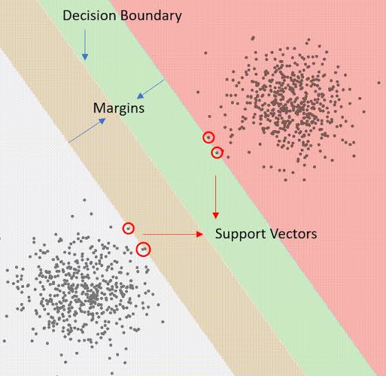

# SVM

SVM(support vector machine) is a meachine learning model where the model draw a decision line from where it classifies data. It is supervised regression-bashed classification meachine learing algorithm. Decision line looks like this:

$$
w^T x + b = 0
$$

**Where:**

- $w^T$ is the weight of model
- $x$ is the input point
- $b$ is the bias

*This is just a simple SVM model. Real one is even more scary!*

## Prediction

The formula given above is just decison line. When any value of x returns $\leq 0$ it is classified as different class and if it returns $>0$ it is different class

**Note:** *SVM classifies data into only 2 classes.*

$$
z = w^T x + b 
$$

**Here:**

If:

$$
z \leq 0
$$

**Then:**

$$
\hat{y} = -1
$$

Else:

$$
\hat{y} = 1
$$

## Margins

This is the perpendicular distance between decision line and support vector on the distance 1. there are 2 margin boundries which is defined as:

$$
w^T x + b = +1
$$

and 

$$
w^T + b = -1
$$

Therefore each side is:

$$
\frac{1}{||w||}
$$

So the total margin is 

$$
\frac{2}{||w||}
$$

### Hard margin

Hard margin a margin where it needs classes to be perfiectly classified. It doesn't allow misclassification and points lie on the margin.

$$
y_i(w^T x_i + b) \geq 1
$$

It's objective is to maximize the margin

$$
\max \frac{2}{||w||}
$$

**Limitation:** It's focus is on perfection. Therefore, noicy data might not give the best solution

### Soft margin

Soft margin is a system where we focus on soft and good classification where miss classfication and entring margin are allowed. We introduce a slack variable or slack error to calculate the error for misclassification or margin entrance.

$$
\xi_i \geq 0
$$

Here $\xi$ is the huge loss defined as:

$$
\xi_i = max(0, 1 - y_i f(x_i))
$$

so the contrast is:

$$
y_i (w^T x_i + b) \geq 1 - \xi_i
$$

with objective:

$$
\min_{w,b,\xi} \frac{1}{2} ||w||^2 + C \sum_{i} \xi_i
$$

Here c is a constant where:

- **Larger $C$:** promotes correct data classification
- **Smaller $C$:** promotes wider margin.

## Distance

This is the physical perpendicular distance between decison line and a training point. Physical distance of any point is equal to:

$$
D = \frac{|w^T x_i|}{||w||}
$$

## Support vectors

These are the datapoint near the decision line. Usually they are the points below margin 1. They are often used in dual and kernel trick.

# Linear SVM

This is a simple svm model which has a simple linear dicision line and where model predict it as a class if it's y is above the decision line else it predict as another class.

It's decision line looks something like this:

$$
y = wx+b
$$

**Where:**

- $w$ is the weight.
- $b$ is the bias.
- $x$ is the input data

## Loss

Here we use the Huge loss formula

$$
L = max(0, 1-y_i \hat{y_i})
$$

**Here:**

- $y_i$ is the true y.
- $\hat{y_i}$ is the predicted y.

## Greadients and it's decent

The greadient for hard margin looks like this:

w.r.t. w:

$$
\frac{\partial L}{\partial w} = -y_i x_i
$$

w.r.t. b:

$$
\frac{\partial L}{\partial b} = -y_i
$$

The greadient decient is same as every other algorithm:

$$
w = w - \frac{\partial L}{\partial w}
$$

$$
b = b - \frac{\partial L}{\partial b}
$$

The greadient for soft margin looks like this:

w.r.t. w:

$$
\frac{\partial J}{\partial w} = w - C \sum_{m_i < 1} y_i x_i
$$

w.r.t. b:

$$
\frac{\partial J}{\partial b} = -C \sum_{m_i<1} y_i
$$

**Here:**

$$
m = y_i (w^t x + b)
$$

# Dual 

This repleces the weight and bias with one variable alpha. This requires support vectors to work. This transforms the original contrained optimization problem into an equivalent maximization problem that depends on lagarange multiplier and dot products between data points.

It looks something like this:

$$
q(\alpha) = \sum_{i} a_i - \frac{1}{2} \sum_{i} \sum_{j} \alpha_i \alpha_j y_i y_j x_i^T x_j
$$

**where:**

- $i$ is the index for support vector.
- $j$ is the index for training/testing points.

Then we maximize the dual function:

$$
\max_{a} q(\alpha)
$$

with contrast:

$$
0 \leq \alpha \leq C
$$

and 

$$
\sum_{i} \alpha_i y_i = 0
$$

Lagarange enumerate the weight in the form of:

$$
w = \sum_{i} \alpha_i y_i x_i
$$

Therefore, our prediction becomes:

$$
f(x) = \sum_{i} \alpha_i y_i x_i^T x + \frac{1}{|S|} \sum_{k \in S} \(y_k - \sum_i \alpha_i y_i x_i^T x_k \)
$$

**Where:**

- $k$ and $i$ both are support vector 
- $x$ is the training point
- $x_i$ is the support vector point

## Linear Dual

Everything given above was Linear dual. Here classfication is linear. 

### Prediction

Prediction of a model look something like this:

$$
f(x) = \sum_{i} \alpha_i y_i x_i^T x + \frac{1}{|S|} \sum_{k \in S} \(y_k - \sum_i \alpha_i y_i x_i^T x_k \)
$$

and 

$$
\hat{y} = \text{sign}(f(x))
$$

### Loss

Here loss seems something like this:

$$
\mathcal{L}(\alpha) = - \sum_{i} a_i + \frac{1}{2} \sum_{i} \sum_{j} \alpha_i \alpha_j y_i y_j x_i^T x_j
$$

**But** this is only while training.

for test data we use:

$$
L_{hinge} =  \frac{1}{n} \sum_{j=1}^{n} \max(0, 1 - y_j f(x_j))
$$

### Greadient and it's decent

greadient w.r.t. a

$$
\frac{\partial \mathcal{L}}{\partial \alpha} = y f(x) - 1
$$

Greadient decent

$$
\alpha = \alpha - \frac{\partial \mathcal{L}}{\partial \alpha}
$$
